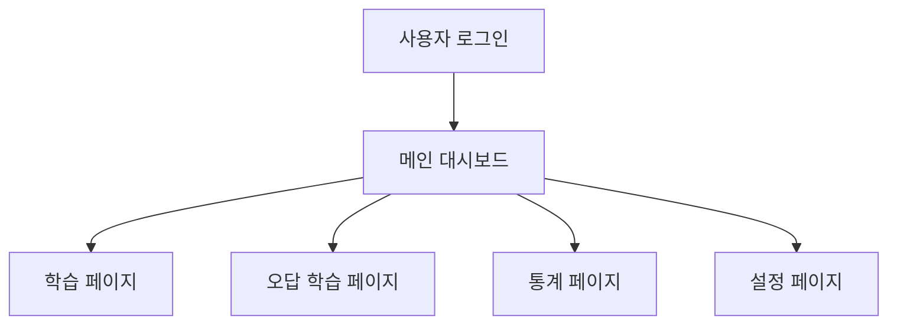

## 나만의 맞춤 암기장
본 프로젝트는 라이트너 암기 방식을 차용한 개인 맞춤형 암기장의 개발입니다.
동적 카드 학습 알고리즘, 자동 오답노트 생성, 정답률 추적 등을 통해 최상의 학습 경험을 제공하는 것이 프로젝트의 최종 목표입니다.

## 로컬 설치 방법
1) 프로젝트 클론 및 IDE로 열기
2) 터미널에 npm install
3) root에 .env.local 파일 생성
4) Supabase 접속하여 Project 생성
5) NEXT_PUBLIC_SUPABASE_URL=[본인 Supabase project id].supabase.co
6) NEXT_PUBLIC_SUPABASE_ANON_KEY=[본인 Supabase Key]
7) 위 두 코드 .env.local에 붙여넣기
8) Supabase SQL Editor에 아래 코드 붙여넣기
``` sql
-- 1. Decks 테이블 생성
create table decks (
  id bigint generated by default as identity primary key,
  user_id uuid default auth.uid(),
  title text,
  description text,
  is_wrong_note boolean default false,
  order_index int default 0,
  created_at timestamptz default now()
);

-- 2. Flashcards 테이블 생성
create table flashcards (
  id bigint generated by default as identity primary key,
  user_id uuid default auth.uid(),
  deck_id bigint references decks(id) on delete cascade,
  question text,
  answer text,
  box_level int2 default 1,
  next_review_at timestamptz default now(),
  is_wrong boolean default false,
  correct_count int default 0,
  incorrect_count int default 0,
  created_at timestamptz default now()
);

-- 3. Study Logs 테이블 생성
create table study_logs (
  id bigint generated by default as identity primary key,
  user_id uuid default auth.uid(),
  is_correct boolean,
  created_at timestamptz default now()
);

-- 4. RLS 설정
alter table decks enable row level security;
create policy "Users can CRUD their own decks" on decks for all using (auth.uid() = user_id);

alter table flashcards enable row level security;
create policy "Users can CRUD their own cards" on flashcards for all using (auth.uid() = user_id);

alter table study_logs enable row level security;
create policy "Users can CRUD their own logs" on study_logs for all using (auth.uid() = user_id);
```
9) Supabase Authentication -> Providers에서 Google 찾아 Callback URL (for OAuth) 복사
10) Google Cloud Console에서 새 프로젝트 생성, Credentials로 이동
11) 사용자 인증 정보 만들기 -> OAuth 클라이언트 ID 선택, 유형 웹 애플리케이션으로 설정
12) 승인된 리디렉션 URI에 Callback URL (for OAuth) 붙여넣기
13) 생성된 Client ID와 Client Secret 각각 Supabase에 붙여넣기
14) Enable Sign in with Google 토글 켜고 저장
15) Supabase Authentication -> URL Configuration에서 Site URL에 http://localhost:3000 입력
16) Redirect URLs에 http://localhost:3000/** 입력 후 저장
17) 터미널에 npm run dev 실행 후 http://localhost:3000 접속

## 기술 스택
| 분류 | 기술 스택 |
| --- | --- |
| Framework	| Next.js 15 (앱 라우터) |
| Language	| TypeScript |
| Backend / DB	| Supabase |

## 핵심 기능
* 구글 소셜 로그인을 통한 유저별 연동
*  학습 대시보드: 일일 학습량, 정답률, Streak, 캘린더 시각화
*   나만의 단어장 관리: 다양한 암기 박스 생성, 수정, 삭제 및 드래그 앤 드롭 정렬
*   암기 곡선 최적화 학습 알고리즘
    * 라이트너 시스템(정답이면 상위 박스, 오답이면 하위 박스)
    * 오답 여부와 최근 학습 기반 가중치 부여 시스템
    * 카드별 정답률 표시
* 오답노트: 틀린 카드는 자동으로 수집되어 복습 가능
* 통계 페이지: 최근 7일간의 정답률 추이 및 박스별 카드 분포 그래프
* 사용자 설정: 라이트-다크 테마 변경

## 플로우차트

## 파일 구조
* beatus_flashcard
    * 📂 app
        * 📂 api/cards - API 라우트
        * 📂 settings - 프로필 및 설정 페이지
        * 📂 statistics - 학습 통계 페이지
        * 📂 study/[id] - 학습 페이지
        * 📄 globals.css - 전역 스타일
        * 📄 layout.tsx - 레이아웃 및 테마
        * 📄 page.tsx - 메인 대시보드
    * 📂 lib
        * 📄 supabase.ts - Supabase 클라이언트 설정
    * 📄 .env.local - 환경 변수
    * 📄 next.config.ts - Next.js 설정
    * 📄 tailwind.config.ts - Tailwind & 다크모드 설정
    * 📄 package.json - 의존성 관리
