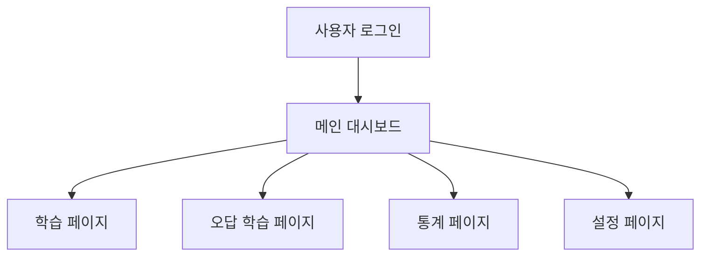

## 나만의 맞춤 암기장
본 프로젝트는 라이트너 암기 방식을 차용한 개인 맞춤형 암기장의 개발입니다.
동적 카드 학습 알고리즘, 자동 오답노트 생성, 정답률 추적 등을 통해 최상의 학습 경험을 제공하는 것이 프로젝트의 최종 목표입니다.

## 로컬 설치 방법
1) 프로젝트 클론 및 IDE로 열기

## 기술 스택
| 분류 | 기술 스택 |
| --- | --- |
| Framework	| Next.js 15 (앱 라우터) |
| Language	| TypeScript |
| Backend / DB	| Supabase |

## 핵심 기능
* 구글 소셜 로그인을 통한 유저별 연동
*  학습 대시보드: 일일 학습량, 정답률, Streak, 캘린더 시각화
*   나만의 단어장 관리: 다양한 암기 박스 생성, 수정, 삭제 및 드래그 앤 드롭 정렬
*   암기 곡선 최적화 학습 알고리즘
    * 라이트너 시스템(정답이면 상위 박스, 오답이면 하위 박스)
    * 오답 여부와 최근 학습 기반 가중치 부여 시스템
    * 카드별 정답률 표시
* 오답노트: 틀린 카드는 자동으로 수집되어 복습 가능
* 통계 페이지: 최근 7일간의 정답률 추이 및 박스별 카드 분포 그래프
* 사용자 설정: 라이트-다크 테마 변경

## 플로우차트

## 파일 구조
* beatus_flashcard
    * 📂 app
        * 📂 api/cards - API 라우트
        * 📂 settings - 프로필 및 설정 페이지
        * 📂 statistics - 학습 통계 페이지
        * 📂 study/[id] - 학습 페이지
        * 📄 globals.css - 전역 스타일
        * 📄 layout.tsx - 레이아웃 및 테마
        * 📄 page.tsx - 메인 대시보드
    * 📂 lib
        * 📄 supabase.ts - Supabase 클라이언트 설정
    * 📄 .env.local - 환경 변수
    * 📄 next.config.ts - Next.js 설정
    * 📄 tailwind.config.ts - Tailwind & 다크모드 설정
    * 📄 package.json - 의존성 관리
